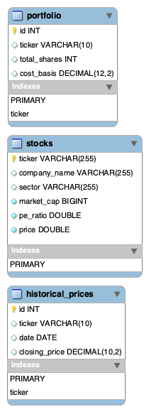

# Simple Stock Portfolio Application

This project is a small-scale, full-stack application designed to consolidate knowledge of SQL, Spring Boot, REST APIs, and vanilla front-end development. It serves as my first comprehensive Spring Boot project.

## Usage

* **Viewing Stocks:** The stock data table is displayed upon opening the application.
* **Searching Stocks:** Enter a ticker symbol in the search input and click "Search" to view specific stock details. If no stock is found, an alert will be displayed.
* **Updating Stocks:** Modify the editable fields (Price, Market Cap, P/E Ratio) directly in the table and click "Save" to update the stock information in the database.
* **Deleting Stocks:** Click "Delete" on a stock row to remove the stock from the database.
* **Adding Stocks:** Fill out the form fields (Ticker, Company Name, Price, Market Cap, P/E Ratio, Sector) and click "Add Stock" to add a new stock to the database.

## Technologies Used

* **Backend:**
    * Spring Boot (Java)
    * Spring Data JPA (for database interaction)
* **Database:**
    * MySQL
* **Frontend:**
    * HTML
    * CSS (Enhanced for improved responsiveness and visual appeal)
    * JavaScript (Vanilla)

## Recent Enhancements

* **Improved Delete Functionality:** Resolved foreign key constraint issues to enable successful deletion of stocks.
* **Enhanced Search Functionality:** Implemented precise stock searching by ticker symbol with error handling for non-existent stocks.
* **Responsive and Professional UI:** Refined CSS for a more visually appealing and responsive user interface, ensuring a consistent experience across various screen sizes.

## Future Enhancements

* Implement user authentication and authorization.
* Integrate a third-party API to fetch real-time stock data, including historical data and charts.
* Transition the front-end to a modern JavaScript framework like React for improved UI/UX.
* Add data validation and comprehensive error handling for user inputs.
* Implement sorting and filtering options for the stock table.
* Deploy the application to a cloud platform (e.g., Heroku, AWS).
* Purchase a domain and make the website publicly accessible.

## Database Schema

The database schema is visualized in the following diagram:



## Setup and Installation

1.  **Clone the Repository:**

    ```bash
    git clone [repository URL]
    cd [project directory]
    ```

2.  **Database Setup:**

    *SQL script for creating the database schema: [here](script.sql).

4.  **Backend Setup:**

    * Navigate to the backend directory.
    * (If using Maven or Gradle) Build the project using:

        ```bash
        ./mvnw spring-boot:run # Maven
        ./gradlew bootRun # Gradle
        ```

    * The backend server will start on `http://localhost:8080`.

5.  **Frontend Setup:**

    * Open `index.html` in your web browser.
  

## Author

* [Marvel Bana] - [[Your GitHub Profile URL](https://github.com/Marvel1738)]
